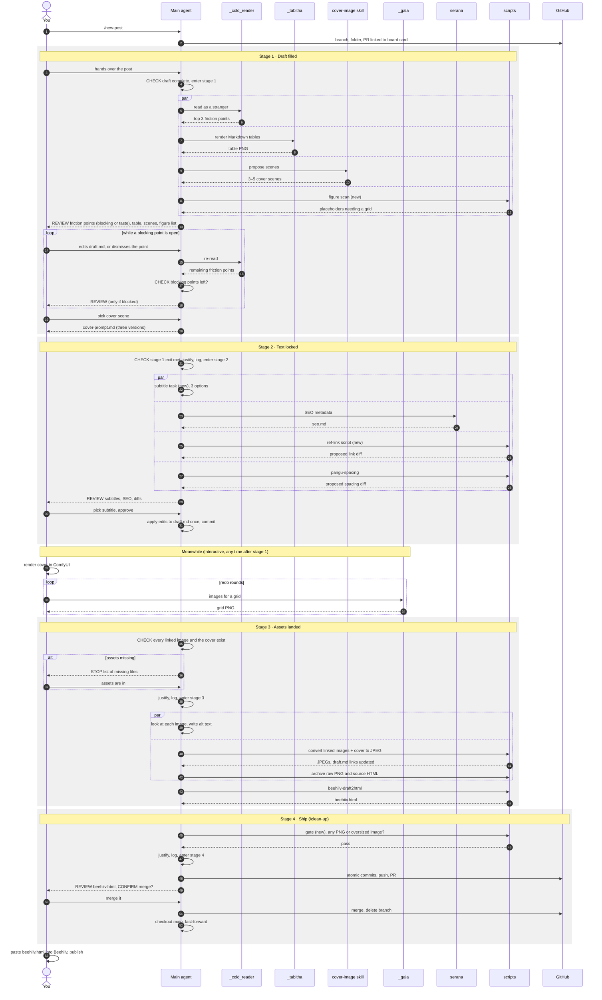

# Post workflow — draft to publish

A post moves through four stages. **You decide which stage the post is in and when it moves to the next one, and you say why.** I don't declare stages and I don't name sub tasks. You stop only when you need a decision from me or something only I can do.

## The check

Whenever I hand you the post ("continue", "done", "fixed", "cover is in", or any request about the post on its branch), look at the article folder and `stage-log.md`, find the first stage whose exit condition is not met, and run it. When a stage's exit condition is met, write one line of justification and go straight into the next stage in the same turn.

| Stage | Enter when | You run | Exit when |
|---|---|---|---|
| 1 · Draft filled | `draft.md` is no longer the placeholder and has no unfinished section or TODO | `_cold_reader`, `_tabitha` on every Markdown table, cover scene candidates (`cover-image` skill), figure scan | no blocking friction point is left open, tables are rendered, I picked a cover scene and `cover-prompt.md` exists |
| 2 · Text locked | stage 1 exited | 3 subtitle options, `serana` (SEO → `seo.md`), reference-link formatting, `pangu-spacing` | I picked a subtitle, the approved edits are in `draft.md` and committed, `seo.md` exists |
| 3 · Assets landed | stage 2 exited, every image `draft.md` links to exists, no image placeholder is left, a cover file exists | alt text, image conversion, raw archive, `beehiiv.html` (this is `/post-process`) | every linked image and the cover are JPEG, `beehiiv.html` is regenerated |
| 4 · Ship | stage 3 exited and the image gate passes | `/clean-up` up to the push, then ask me to check `beehiiv.html` and confirm the merge | merged, back on `main` |

## Rules

1. **You move the stage, with a reason.** Each transition is one line: `Stage 1 → 2: <what you checked and found>`. Append the same line, dated, to `stage-log.md` in the article folder.
2. **Stop only for me.** Valid stops: a review that needs my choice, a blocking friction point I have to fix in the text, assets only I can make (cover render, images for a grid), the merge confirmation. Every stop says which exit condition is unmet and exactly what you need from me. Never stop to ask which stage we are in.
3. **Judging the cold read.** `_cold_reader` always returns friction points. A point is *blocking* if a stranger would lose the thread or misread the claim (undefined term, missing step, broken reference). Anything else is taste. Stage 1 exits when no blocking point is open. A point I dismiss is recorded in `stage-log.md` and never raised again.
4. **Stage 1 loops.** When `draft.md` changed since the last cold read, re-run `_cold_reader` only, then judge again.
5. **Fan out in one message.** Launch the stage's subagents together, in parallel. This file is my standing request to spawn them.
6. **Parallel tasks propose; the main agent writes.** Nothing in a `par` block edits `draft.md`. After I approve, apply all edits to `draft.md` once, then commit. Exceptions: `serana` writes `seo.md`, `_tabitha` writes its PNG.
7. **One fan-in review, numbered.** Give me one message with numbered items so I can answer "1 ok, 2 drop, 3 …". Relay `_cold_reader` exactly as `agents.md` says (top 3 friction points, verbatim structure), and mark each one blocking or taste.
8. **Interactive work stays with me.** Rendering the cover in ComfyUI and `_gala` grid rounds happen when I ask. If stage 3 can't start because assets are missing, list the missing files and stop.
9. **Stage 3 converts what the draft links to.** Convert every image `draft.md` references plus `cover.png`, wherever they live in the article folder — not only top-level PNGs. It must be safe to re-run after a late cover arrives.
10. **The gate.** Before any stage 4 commit, check that no image linked from `draft.md`, nor the cover, is still PNG or larger than 500 KB. If one is, fix it by re-running the stage 3 conversion; stop only if that fails.
11. **The merge always needs my yes.** Commit and push without asking; never merge without my confirmation.
12. **Steps marked (new) have no agent or script yet.** Do them yourself, inline: figure scan, subtitle options, reference-link formatting (fold each URL into the paper title), the image gate.
13. **Weekly newsletters** under `newsletter/` use the same stages; skip the cover and figure tasks when there are none.

## The chart

`CHECK` = you test the entry or exit condition and justify the move. `par` = parallel fan-out. The message back to **You** after each block is the fan-in review.

