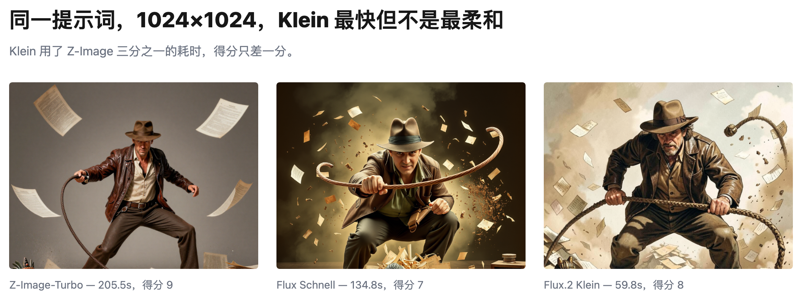

# 本地生图是不是越大越好？

横向对比三个模型看效果

**要点**：不是越大越好，768x768 正合适。从时间花费和品质上看，这个尺寸更优，而且三个不同的模型都是这样。

---

我在自己的 Mac mini（M4，16GB）上测试了三个生图模型（Z-Image-Turbo，Flux Schnell 和 Flux 2 Klein）。我把其他参数都锁上了，只修改尺寸（512，768，1024，1280）。下面会根据时间和品质的维度具体分析。

## 一、尺寸越大耗时越长

单靠直觉我们也能想到这一点。下面的图表也验证了这个想法。

其实设计试验的时候，还是要考虑更多。比如，我不能把每次切换模型的时间算进去，而是要记录纯粹的生图时间。

| Model                | 512        | 768         | 1024        | 1280        | Time multiple (512→1280) |
| -------------------- | ---------- | ----------- | ----------- | ----------- | ------------------------ |
| Z-Image-Turbo GGUF   | 74.82s / 8 | 123.81s / 9 | 205.52s / 9 | 330.36s / 8 | 4.42×                    |
| Flux Schnell GGUF    | 54.83s / 6 | 81.78s / 7  | 134.78s / 7 | 212.05s / 6 | 3.87×                    |
| Flux.2 Klein 4B GGUF | 24.65s / 8 | 37.54s / 9  | 59.82s / 8  | 91.85s / 7  | 3.73×                    |

## 二、768 x 768 是最佳尺寸

真正反直觉的地方在这：尺寸继续加大，品质并不会跟着变好。让我们换个思路，用回报率的角度来看。比如，我们把变大的部分用像素来表示，除以增加的秒数，就能得到「秒/百万像素」这个指标。把三个模型的平均值都算出来，再加上生图品质打分，放在图表上一起看：

从 768 之后的回报率就不高了。

## 三、Flux 2 Klein 最快

如果我们的场景是那种简单的（机器人），Flux 2 Klein 是首选。但是如果我们的场景有复杂的人物动作和构图，就需要换 Z-Image-Turbo 了。

总结一下：尺寸定在 768x768 就够了，场景简单选 Klein，动作和构图复杂就选 Z-Image-Turbo。
