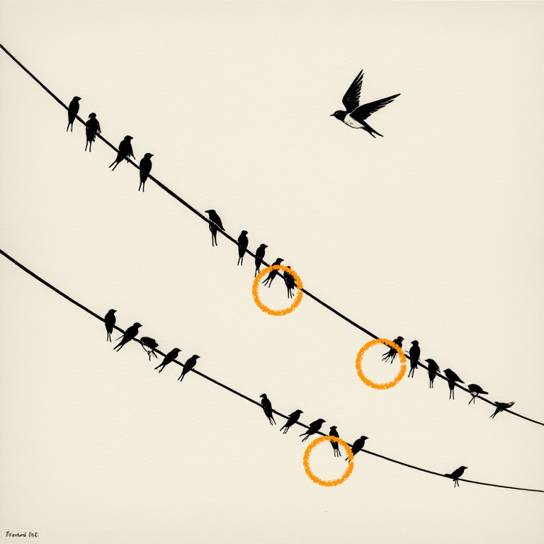
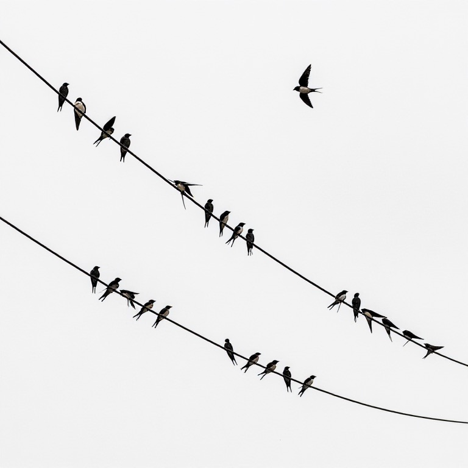
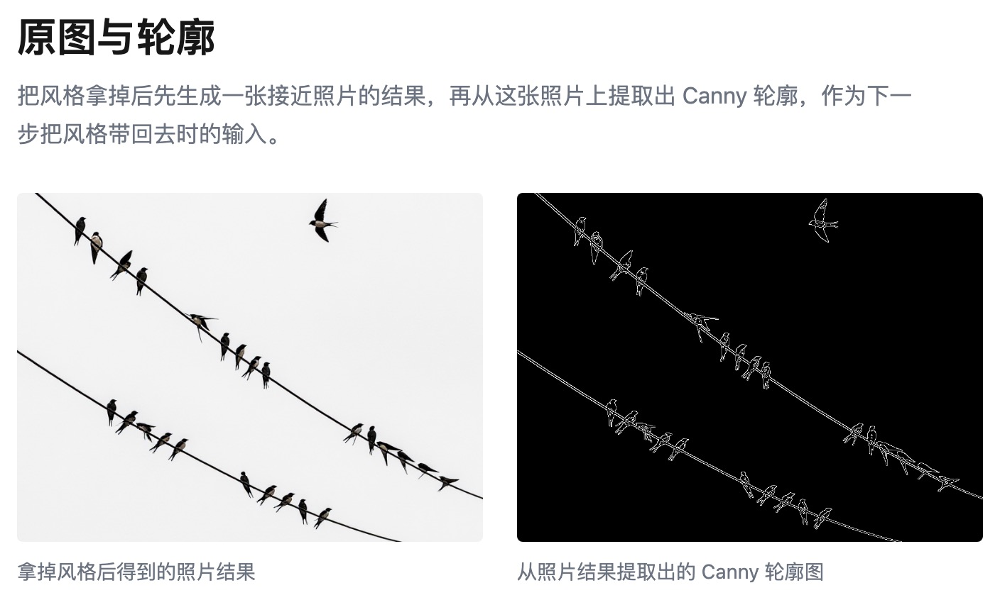
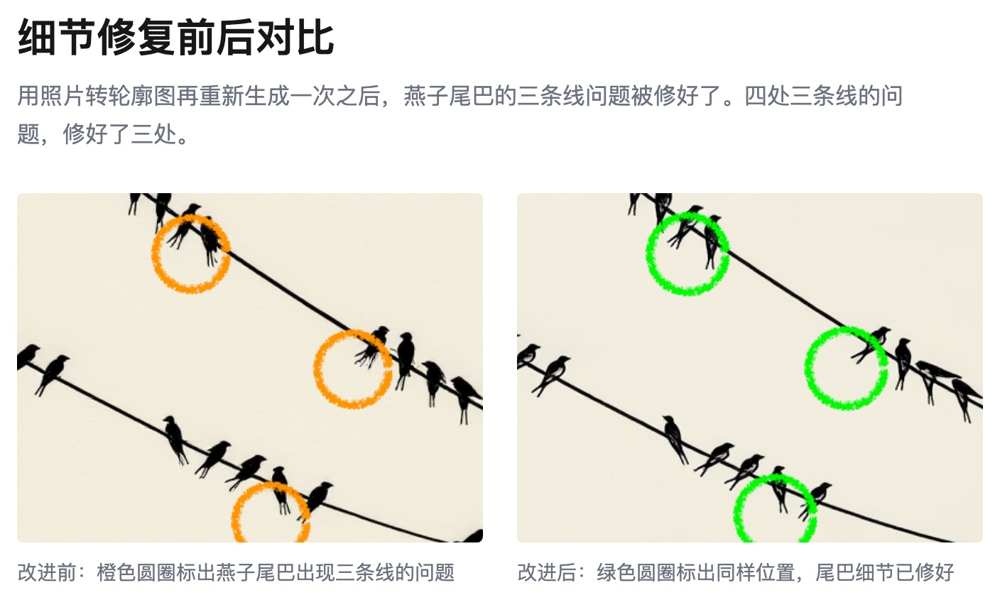

# 做出更好的细节

构图控制住了，细节还得单独打磨

---

上次我们已经能用手绘/轮廓控制构图了，这次要解决细节问题。

用 ControlNet 控制构图生成的图片，如果我们仔细看，会发现有的燕子的尾巴是三条线，可燕子尾巴应该有两个分叉。要修好这一点，我们需要多下一点功夫。

「图：燕子尾巴的特写」

带上风格一下子出来的图没办法保证细节准确。

我的提示词有两段，一段管风格，第二段管内容。

换个思路，先不用风格，先出实物图。实物图能保留更多细节，之后再处理风格。

这次我们先把第一段拿掉，出一幅接近实物的图：

「图：接近实物的图片」

用上面的图当轮廓，输入给 AI，再把风格那段加回来，跑一次：

「图：实物图与轮廓图对比」

一幅细节上更好的图片就出来了：

「图：细节修复前后对比」

---

直接生成某种风格的图，会在细节上有瑕疵。先出实物图，再加上风格，就能保留更多细节。
