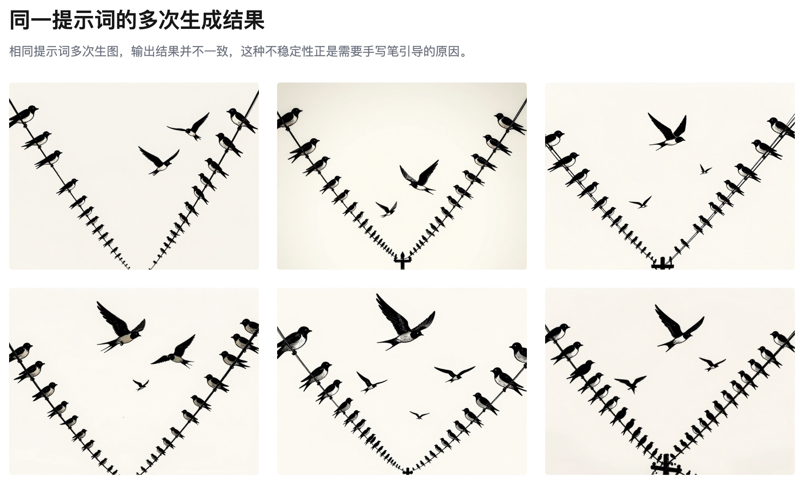
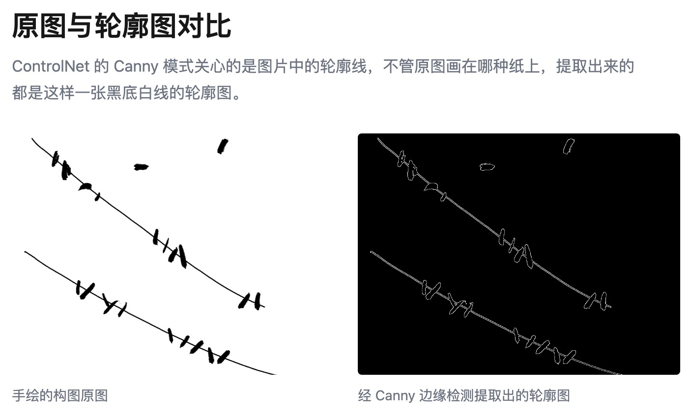

# 用画笔帮助 AI 生图

让 AI 按照你想要的构图出图

**要点：** 把你的脑子里的构图画出来，给 AI 参考着出图。

---

我想让 AI 做一幅燕子落在电线上的封面。比如这样的（照片里其实是鸽子，无所谓，我要的是它们在电线上排布的样子）：

「图：鸽子落在电线上的参考图」

照片由 <a href="https://unsplash.com/@cameramandan83?utm_source=unsplash&utm_medium=referral&utm_content=creditCopyText">[Dan Dennis](https://unsplash.com/@cameramandan83?utm_source=unsplash&utm_medium=referral&utm_content=creditCopyText)</a> 拍摄，分享在 <a href="https://unsplash.com/photos/flock-of-birds-on-wire-under-white-clouds-QuSIi8zGbxs?utm_source=unsplash&utm_medium=referral&utm_content=creditCopyText">[Unsplash](https://unsplash.com/photos/flock-of-birds-on-wire-under-white-clouds-QuSIi8zGbxs?utm_source=unsplash&utm_medium=referral&utm_content=creditCopyText)</a> 上。

## 生成的图片构图错了

我把提示词准备好，给到 ComfyUI（一个搭积木式的 AI 生图工具），但是它生成的图片构图不对，我想生成的是：两条平行又稍微倾斜的电线上三三两两地落着一些燕子：

「图组：多次生图的效果」

有办法可以略微控制一下构图吗？

有的。

ComfyUI 里有个叫 ControlNet 的模块，它能让 AI 照着一张线条图片的轮廓来出图。

## 用画笔控制构图

构图怎么来的呢？用笔画出来就行。

画了大概二十秒：两条弯曲的线表示电线，几个圆点表示燕子的位置，谈不上美观。图片看起来是不是很干净？因为我用了绘图板。但是不用也行。我们在一张纸上画出来也可以的。因为这里的 ControlNet 关心的是图片中的轮廓（Canny 模式）：

「图：原图和轮廓图对比」

所以不管是在格子本上，还是餐巾纸上画的，它都不会介意。而且也不用画得太精细。我用曲线表示电线，粗点示意燕子们的位置。

画完构图，拍照，拖到 ComfyUI ，接上两个节点：一个把照片转成线条轮廓（Canny 边缘检测），一个让 ControlNet 按这个轮廓来控制构图，强度先给 0.8，数值越高，AI 越按照你的轮廓线走，但自由度会变小。点击生成按钮：

「图：最好的结果」

---

电线的角度、距离对了，燕子们也大致落在了我想要的地方，其他细节是 AI 来决定。

把你喜欢的构图用笔简单画出来，给 ComfyUI 做 ControlNet 的参考。它出来的图片就能更好地还原你的设计。
