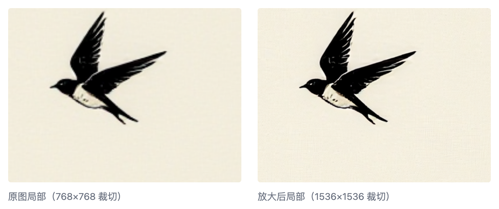

# 把方图改成文章封面的长条图

简单的放大+剪裁就够了

我用模型出来的图片是 768x768 ，方形的。但是我要用在文章封面的是 1200x630 这种长条的。

**要点**：把图片放大，再截取其中的一部分。

---

我第一个想到的是ComfyUI 里的放大功能。

连接上一个不大的专属模型（4x_NMKD-Siax_200k），针对这个四倍放大模型，把放大倍数改成 0.5，按下运行按钮。

一幅 1536x1536 的两倍图就出来了，速度很快。

剩下的是裁剪出需要的尺寸。

ComfyUI 内建的剪切功能就能做到。写好长宽的参数(1200x630)，运行，就有了。默认的截取从图片左上方开始，我需要调节纵向的位移(y=100)，才能得到满意的效果。

一幅符合尺寸的封面图就做好了。这个方法是截取图片里的一部分，作为结果。所以你想保持原来的构图，这个方法就不行了。
