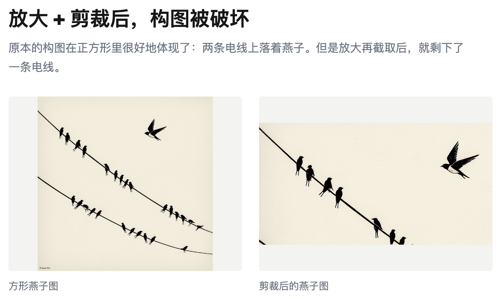
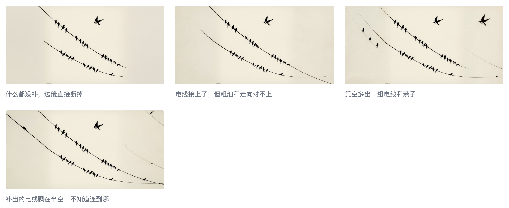

# 拓宽图片的两侧

上次[把方图改成长条图](https://ai-companion-newsletter.beehiiv.com/p/enlarge-square-image-cover)说可以先放大，再截取，得到长条图。这次换一种方式：拓宽图片的两边。

优点是不用放弃之前的构图。

这次我让模型在方形图片的左右两边扩宽画面，这个在 ComfyUI 里叫做 Outpaint。在 ComfyUI 里出方形图很常见，因为很多模型是以方形尺寸训练的。

比如之前的燕子图的构图很好，但是放大+剪裁后，构图就被破坏了。原本的构图在正方形里很好的体现了：两条电线上落着燕子。但是放大再截取后，就剩下了一条电线。

用上 Outpaint ，模型会沿着图片的左右两边向外继续作画。正方形的图片就变成了长方形。我的电子版封面图就是这种尺寸，正好！

图片：正方形燕子图 和 拓宽后的燕子图

这里没有用燕子图，是因为简单内容的图片模型理解得不好，会有各种问题。

Outpaint 其实能向各个方向继续生图，我能生成任何比例的图片。

但是配置上要小心，比如同样生成上面同样的长条图，我只向左扩展的时候，会失败。

图片：失败的燕子图

这是因为我用的 Flux 模型是从正方形这个尺寸训练出来的，如果两倍的长度，它倾向再平铺一个正方形，而不是扩大画面。
