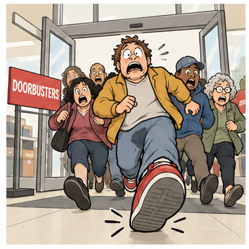

# 今天的单词 - stampede

Stampede 这个词来自 negate 的辅助句子：

> Nick shuts the gate, cancelling stampede's momentum.

  
虽然我可以把上面的句子默写出来，但是几天后，默写到 stampede 这个词还是会卡住。
所以今天干脆和这个词来个了断！&#xA;

Stampede 在语料库（corpus）里的意思是这样的：  

  
然后让 AI 助理 Nemo 来头脑风暴出三个辅助句子，我选了这个：  
Feet stamp, someone peed, doorbusters rush inside.  
再生成个图片：  

我一开始没看懂为什么那个男的会尿裤子，后来看到 someone peed 我才明白。原来是我已经开始默写辅助句子了，却没看出这个细节。  
Peed 这个词也有辅助 stam**pede** 这里发音的作用。它的重音在后面，选 peed 也有这个意思。  

最后是 doorbuster 这个词我不认识，让 Claude 简单解释了一下：

> A doorburster is a really cheap, limited deal a store offers to pull people in -- usually first thing on a big sale day (like Black Friday). There's only a small stock, so people rush in to grab one before it's gone.  
>

嗯，看文章已经够了，不用单独做卡了。  

这就是今天有趣的单词。

