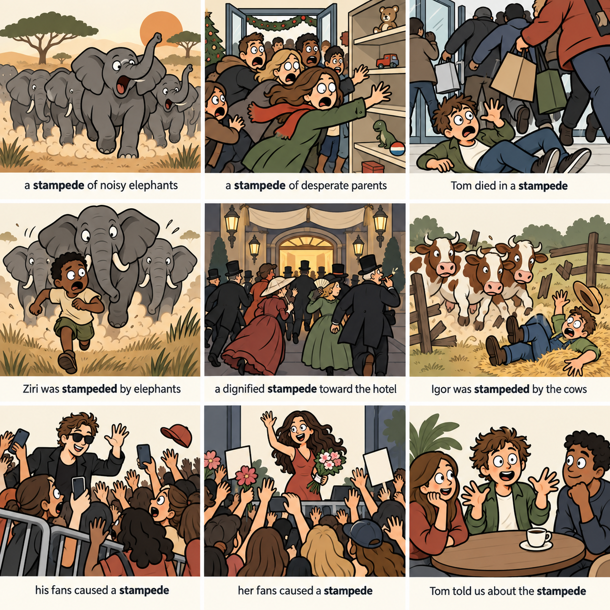

# 今天的单词 - stampede

记单词的句子里，又冒出一个不认识的词

下面的英文我可以整个句子默写出来，但是几天后，默写到 stampede 这个词还是会卡住。

我用一句话来记住单词的发音和意思，我管它叫辅助句。Stampede 这个词来自 negate 的辅助句。比如：

> **Ni**ck shuts the **gate**, cancelling stampede's momentum.

标粗的部分帮助记 negate 的发音，后面 cancelling... 是帮助记意思。

辅助句里一旦出现生词，就会很烦恼。所以今天干脆和这个词来个了断！

先看看它的意思。

Stampede 在语料库（corpus）里的意思是这样的：象群受惊扬尘奔逃、家长挤进玩具店、有人在购物人潮里被撞倒。九个例句里它一半是名词「一窝蜂乱冲」，一半是被动的「被冲撞」。  

然后让 AI 助理 Nemo 来头脑风暴出三个辅助句，我选了这个：

> Feet stamp, someone peed, doorbusters rush inside.

再生成个图片：最前面那个穿黄外套的男的瞪大眼睛，裤裆上一块深色水渍，红球鞋重重跺在地上。  

Stampede 的重音在后面的 -pede，所以 someone 后面放 peed 正好。

即使 AI 都帮我考虑好了，我一旦马虎起来，还是看不出来。我一开始就没看懂：谁知道为什么那个男的会尿裤子啊？后来看到 someone peed 我才明白。

最后是 doorbuster 这个词我不认识，让 Claude 简单解释了一下：

> A doorbuster is a really cheap, limited deal a store offers to pull people in -- usually first thing on a big sale day (like Black Friday). There's only a small stock, so people rush in to grab one before it's gone.

嗯，看文字的解释已经够了，不用继续做辅助句了。

这就是今天有趣的单词。
