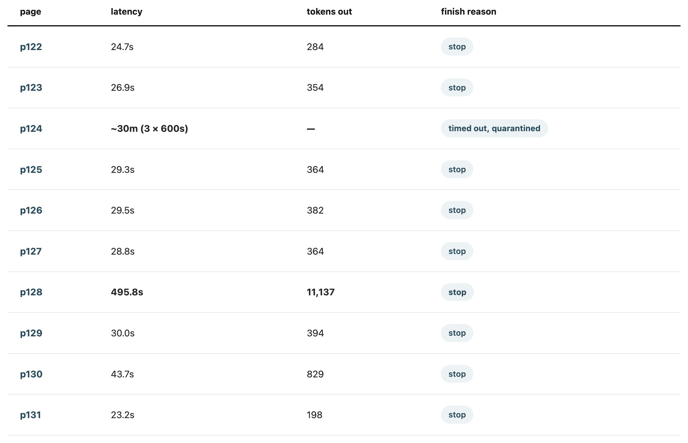

# The Intervention Window

I don't read generated code any more. I read the docs and the summary and take the rest on
trust. That isn't laziness, it's the whole deal: attention is the expensive input, and
handing work off is what makes it cheap. If I read every diff I'd give the saving straight
back.

Mostly this is fine. The ordinary failure — the wrong answer — is caught by the things that
have always caught it: tests, types, a build that breaks, a page that renders wrong. Those
failures announce themselves.

Yesterday I hit one that doesn't.

## The page that succeeded, expensively

I wanted chapter 8 of *The Craft of Research* as Markdown. Ten phone photos of ten pages, a
local vision model, a small OCR pipeline I'd used before. I pointed it at the folder and
went to do something else, which is the point of having a pipeline.

I ran it three times. Here is the third run, one line per page, straight out of the
manifest:



Eight pages took between 23 and 44 seconds. Two did not.

Take p128, the stranger of the two. Eight minutes, thirty times the tokens of its
neighbours. It did not time out — it finished inside the 600-second budget with a hundred
seconds to spare. It did not error. Its finish reason is `stop`: the model ended its own
turn normally, which is the most unambiguous success signal the protocol has.

The file it wrote is 51,373 bytes. The right answer for that page — three hundred words of
book — is about 1,900. The tail of it reads:

```
research.

Limit your

research.

Limit your
```

for roughly forty-nine kilobytes. The model had fallen into a degenerate repetition loop,
then exited cleanly, and the pipeline wrote the result to disk and moved on.

p124 was the same failure with a different ending: its loop never stopped on its own, so it
burned the full 600-second timeout — and then, because the retry policy couldn't tell a hung
generation from a flapping server, did it twice more. Half an hour, no output.

One cause for both, which took me embarrassingly long to see. Here is the photo I fed it.


The page I wanted is flat and square in the frame. The facing one isn't: the book won't lie
open, so that page stands up along the spine and its text reaches the model tilted and
foreshortened — a column of skewed, half-cropped lines jammed down the right edge, including,
I notice only now, the phrase *Limit your clai—*, half a step from the sentence the model
spent eight minutes repeating. It tries to read that column and loops. Crop the facing page
off and p128 converts in 23.8 seconds. A factor of twenty, from one crop.

Those two pages were essentially the entire cost of the batch: 38 of its 42 minutes,
against four minutes for the eight that worked.

## What a summary structurally cannot say

Here is what that run could honestly have reported when it finished.

> Ten pages submitted. Nine converted. One page hung and was quarantined with its
> transport error recorded. No exceptions raised.

That is *true*. It is also, minus one line, the same summary a perfect run would have
produced. The eight-minute page that wrote fifty kilobytes of `Limit your research.` is not
in there at all, because by the only schema the run has — did the call return, did the file
get written — nothing went wrong.

No amount of writing better summaries fixes this. **The one artefact I actually read is the
one artefact that cannot carry the signal.** What says something is wrong here is a
*comparison between pages*, and a summary is precisely the thing that has finished
comparing.

## The signal existed, and it expired

The information wasn't missing. It was on my screen: page after page ticking past at
twenty-odd seconds, and then one page not ticking past, just sitting there while eight
minutes of tokens scrolled. Anyone watching would have seen it. I wasn't, and nothing in
the tool was trying to make me.

What makes progress output different from source code isn't that it's harder to read. It's
that its value has a deadline. Source code can be read whenever — reading it next week
tells you what it tells you today. Progress output is worth something only *before
completion*, because its whole value is the option it preserves. Read during the run, "this
page is taking twenty times too long" means **kill it and crop the image**. Read after, the
same sentence means only **you already paid for that**.

I've started calling that interval the **intervention window**: the span between an agent
starting and finishing, during which a run's cost is still avoidable. It opens
automatically, closes automatically, and its value decays to zero at completion.

And here is what makes it a design problem rather than a discipline problem: nearly every
feature that makes agents nicer to use shortens the window or hides it. Background tasks,
parallel runs, notify-on-complete, fire-and-forget. Each is a deliberate trade of the
window for freedom from it. Usually the right trade! It just isn't free, and right now
nobody prices it.

So this isn't really about reading, and definitely not about reading code — reading is only
the sensor. The question isn't *how carefully did you read* but *did you arrange to still
be there*. And what makes reading worth anything here isn't care. It's **having a normal
to read against**.
Eight minutes on a page is meaningless as a number; it is legible only beside twenty-three
seconds on the page before it. By that measure a newcomer's careful line-by-line review of
my pipeline's source is worth *less* than a three-second glance at a latency column. The
novice reads more and sees less.

## "Just automate it"

The obvious objection, and I'd make it myself: this is a configuration bug, not an insight.
Bound the output and go back to not looking. The strong version is one I missed at
first — the request body set no `max_tokens` at all. Generation was unbounded, and the
timeout was merely the thing that eventually noticed. One line would have capped an
11,137-token loop at source, deterministically, with nobody in the room.

Which looks like it collapses all of this into "set your limits." Nobody disputes that.

The answer is in the order of events:

> **watch → spot → encode → stop watching**

You can only write a guardrail against a failure someone has already met. Nobody bounds a
completion length they have never seen exceeded. **The assertion is the fossil of the
encounter.**

And *what* I encoded gives this away even more than the fact that I encoded it. Retry freely
when the server burps, give up on the first hang, because a burp doesn't repeat and a hang
does. That is in no documentation and not recoverable from the source. The only place it was
ever legible is in front of a running batch.

So automation doesn't compete with attention. It is what attention leaves behind. Pipelines
can be run unwatched not because they never needed watching, but because somebody already
did it and the residue is still there.

## What watching doesn't buy

Before any of this, I had Claude Code proofread the output: all ten converted pages read back
against the photos, line by line. It took longer than the conversion did, and it is the only
reason I know what the run actually produced rather than what the manifest says it produced.

Two things I would rather say myself than have someone find. Both turn on the same gap: the
pages that were expensive and the pages that came out *wrong* are different sets, and they
barely overlap.

**The window sees cost. It does not see correctness.** p130 reordered its page and appended
two hundred words that aren't in the book — at 43.7 seconds and 829 tokens, the largest of
the eight ordinary pages and nowhere near far enough out to catch a distracted eye. Whatever
the window is worth, it is not a detector.

**And one failure class is beyond watching entirely.** That proofread turned up corrections
on pages that were fast, normal-sized and clean-looking. Two of them invert the meaning of
their sentence. One turns "distrust flatfooted certainty **expressed** in words like …" into
"certainty **except** in words like …" — one word, and the advice now says the opposite. In
the other, a historian's interest in **deifying** FDR became an interest in **defying** him.
A page that drops a clause or changes one letter costs no extra seconds and emits no extra
tokens. Only reading the output against the source finds it. Watching does not substitute for
checking the work.

## What I actually want

"Watch more" is weak advice and it will not survive contact with the workflows that make
agents worth using. The consequence lands on tools.

Progress output today is designed as *reassurance* — proof that something is happening.
This episode suggests its real job is *comparison*. A per-step latency shown against a
running median. A token count shown against that step's own history. An outlier marked
while it is still an outlier and not yet a completed fact. Each of those would turn a
scrolling wall into something a distracted person could catch.

And one thing worth sitting with: if guardrails really are the residue of past attention,
then a pipeline's config file is a readable history of everything that has gone wrong in
it. Which would make the most useful thing to hand a newcomer not the source, but the list
of limits somebody else had to learn.
