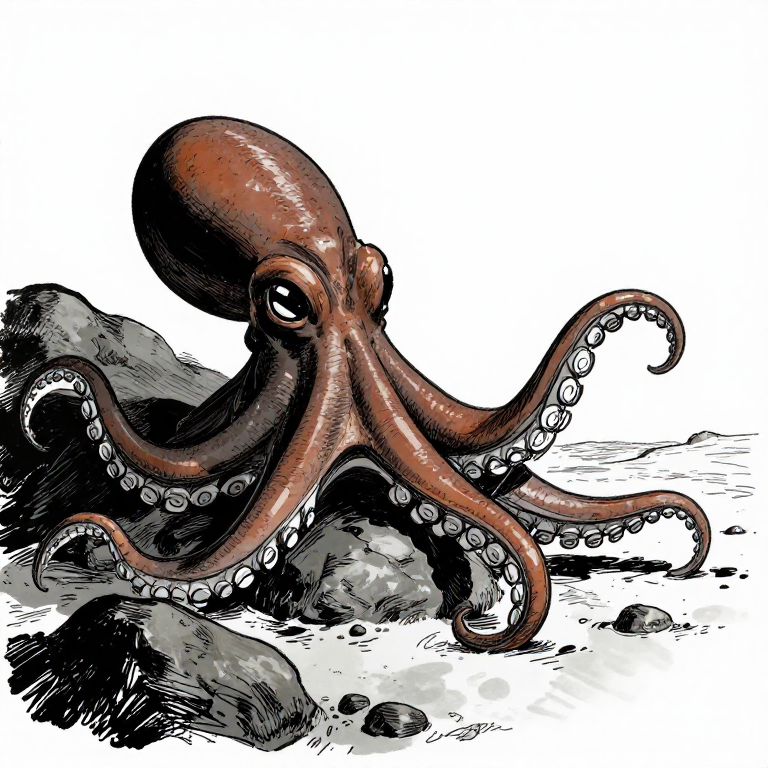
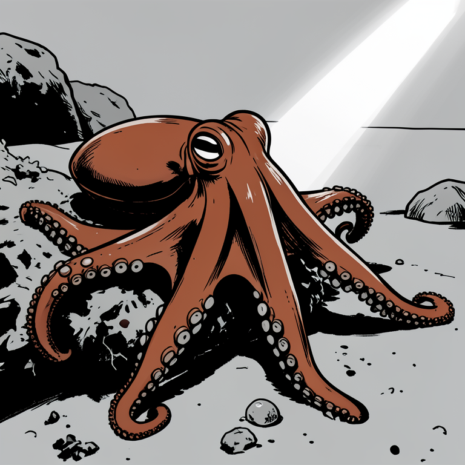

# Ink Style based on the photorealistic way
出图和写代码一样，大步拆成小步才好控制

我的文章封面都是那种 Framed Ink 风格的：高对比，黑白风，自然景色。自从换成本地出图模型之后，这种风格和之前 Nano Banana 直接出的效果差了很多。

这次我用了另一个流程：生成实景图，再上风格。

你可能会想：直接让 AI 一次性出图不是更方便？AI 能按照提示词直接生出一个有场景有风格的图。一次生成，时间还省了一半。

的确可以，但效果不好。

比如出来的图片构图不好，或者细节和真实生物不同，那么我还是要再让 AI 出几张，才能抽到满意的效果。

为了更好的控制，我先让 AI 出了一幅实景图。为了保证效果正确，我还特意加上了专门的提示词。

内容满意了之后。我再让 AI 给这个实景图配上风格转换的提示词，引导它往 Framed Ink 风格上靠。

对比下来，两步走的流程效果要好些：

这种做法和 Coding 里的拆分思路一样。就是尽可能地把一个大步走拆成几个小步骤，你就可以在每一个小步骤上控制效果，最后总的效果也会变得更好。
