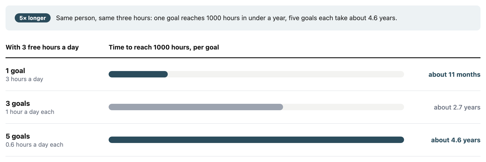

# Calendar Time

Most beginners believe that the more goals they practise each day, the more they will
grow. I believed it too. Then I found that the right number of goals isn't a question of
ambition, or of what fits on a screen. It depends on how many hours you have in a day.

## Where I started: a readable screen

I'm building an app called Time-Cost-Averaging. It borrows from dollar-cost averaging:
invest a fixed amount every day and let the total grow, except the currency is time. My
half-hour time log records everything but never adds anything up, so I can't see
progress toward anything.

I gave the app three accounts, each with a 1000-hour goal: **English words** (2–3 hours a
day), **Writing** (2–3 hours) and **Fitness** (dog walks, housework, short exercise:
about 1 hour). Everything else is logged as "other". My reason: three accounts keep the
big picture readable.

That's a fair design reason, but it tells a beginner nothing. "Keep your screen tidy"
doesn't say how many goals *you* should choose.

## What I believed next, and why it was wrong

My second answer felt deeper. I thought a skill only grows if you practise it for about
three hours a day. Below that, your "mind muscle" never breaks and rebuilds. A beginner
who splits three hours across five goals (words, writing, sketching, comics, vibe
coding) would get nowhere.

The research didn't back me up.

- **There's no daily floor.** People who revised vocabulary 13 times, 56 days apart,
  remembered it about as well as people who revised 26 times, 14 days apart (Bahrick et
  al., 1993). Practising recall beats re-reading by a wide margin (Karpicke & Roediger,
  2008). Short, spaced practice isn't wasted.
- **Even muscles don't work that way.** Muscle damage isn't what drives growth (Damas et
  al., 2018).

Two things survived, and they're the real reason behind the number.

## Reason one: there's a ceiling

Ericsson and colleagues (1993), the study behind the "10,000 hours" idea, found
"essentially no benefit from durations exceeding 4 hr per day and reduced benefits from
practice exceeding 2 hr". Those were elite performers, so I treat the numbers as a rough
guide. But the shape matches my desk: useful practice in one skill **appears to level
off at around two to four hours a day.** After two focused hours of words, I need a long
break before the next round.

That's why I can run three accounts *right now*. I'm not working, so I have six to nine
free hours. Poured into one skill, most of them would go past the point where it stops
absorbing them. Spread across three, they get used.

## Reason two: below the ceiling, every goal divides the same hours

Most beginners have one to three free hours, not six to nine. Below the ceiling, every
extra goal just divides the same small pile of time. For a 1000-hour goal:

Same person, same three hours. One goal reaches its finish line in under a year; five
goals each reach theirs four and a half years from now.

One objection: postmen learning to type got the most out of each hour at one hour a day
(Baddeley & Longman, 1978). True, but that group also took four times as many weeks to
finish. Efficiency per hour and time to the finish line are different questions.

## The condition: spaced review

The table only holds if **those hours are spent with spaced review**: coming back to old
material at growing intervals instead of cramming and moving on.

For each new English word, I write a mnemonic sentence that leaves the word out but
carries sound and meaning anchors back to it. A mnemonic like that speeds up learning
but fades without recall practice (Chiu & Hawkins, 2023), and with the same total time,
spreading practice out beats massing it (Lotfolahi & Salehi, 2017). Fifteen minutes of
spaced review a day makes real progress; three hours without it can lose much of it.

## Why the first three months matter

Many new gym members quit before their third month (Sperandei et al., 2016), and "no
time or energy" is among the most common reasons (Gjestvang et al., 2020).

My own pattern is a U shape. Month one is exciting. Month two is the plateau: the
novelty is gone and progress is hard to see. Month three is when progress begins to
show. That's my experience, not a law, but the plateau is where I've quit before.

Spread a few hours across five goals and none may show visible progress before the
plateau hits. Put them into one and track it, and the balance grows fast enough to
notice. Seeing progress tends to help people keep going (Harkin et al., 2016).

## So, how many accounts?

Not three because three looks nice. Count your free hours first.

- **Six to nine?** Several goals can make sense; one skill can't absorb them all.
- **One to three?** It's worth considering starting with one account. Add a second when
  you have hours left over past the point where the first stops absorbing them.

1000 hours is a milestone, not a guarantee; practice explains only part of why people
differ in skill (Macnamara et al., 2014). But reaching it in 11 months rather than 4.6
years may decide whether you're still practising when month three arrives.

---

## References

A warning before you rely on any of these: I haven't read the papers myself. AI searched
for them as evidence for my argument, so check the original before you cite one.

- Baddeley, A. D., & Longman, D. J. A. (1978). The influence of length and frequency of
  training session on the rate of learning to type. *Ergonomics*, 21, 627–635.
- Bahrick, H. P., Bahrick, L. E., Bahrick, A. S., & Bahrick, P. E. (1993). Maintenance
  of foreign language vocabulary and the spacing effect. *Psychological Science*, 4,
  316–321.
- Chiu, C.-H., & Hawkins, C. F. (2023). [The effectiveness of combining the keyword
  mnemonic with retrieval practice on L2 vocabulary learning in Taiwanese EFL classes](https://doi.org/10.23971/jefl.v13i2.6313).
  *Journal on English as a Foreign Language*, 13(2).
- Damas, F., Libardi, C. A., & Ugrinowitsch, C. (2018). *European Journal of Applied
  Physiology*, 118, 485–500.
- Ericsson, K. A., Krampe, R. T., & Tesch-Römer, C. (1993). The role of deliberate
  practice in the acquisition of expert performance. *Psychological Review*, 100,
  363–406.
- Gjestvang, C., Abrahamsen, F., Stensrud, T., & Haakstad, L. A. H. (2020). [Motives and
  barriers to initiation and sustained exercise adherence in a fitness club setting—A
  one-year follow-up study](https://pmc.ncbi.nlm.nih.gov/articles/PMC7497044/). *Scandinavian Journal of Medicine & Science in Sports*,
  30(9), 1796–1805.
- Harkin, B., et al. (2016). Does monitoring goal progress promote goal attainment?
  *Psychological Bulletin*, 142, 198–229.
- Karpicke, J. D., & Roediger, H. L. (2008). The critical importance of retrieval for
  learning. *Science*, 319, 966–968.
- Lotfolahi, A. R., & Salehi, H. (2017). [Spacing effects in vocabulary learning: Young
  EFL learners in focus](https://doi.org/10.1080/2331186X.2017.1287391). *Cogent Education*, 4(1), 1287391.
- Macnamara, B. N., Hambrick, D. Z., & Oswald, F. L. (2014). Deliberate practice and
  performance in music, games, sports, education, and professions. *Psychological
  Science*.
- Sperandei, S., Vieira, M. C., & Reis, A. C. (2016). [Adherence to physical activity in
  an unsupervised setting: Explanatory variables for high attrition rates among fitness
  center members](https://researchers.westernsydney.edu.au/en/publications/adherence-to-physical-activity-in-an-unsupervised-setting-explana/). *Journal of Science and Medicine in Sport*.
