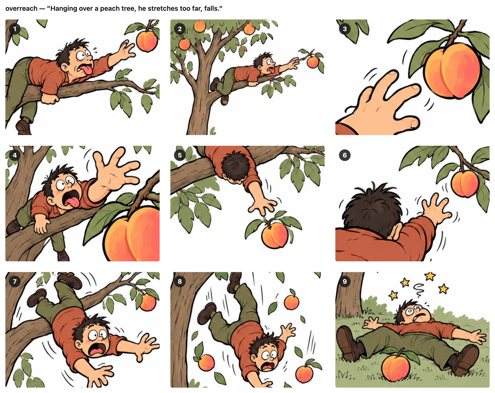
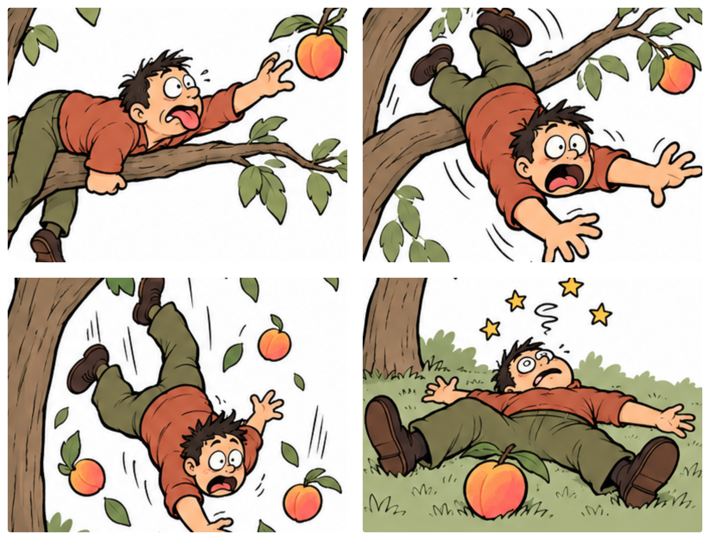

# 用漫画背单词

我用图片帮忙背单词已经很久了。

每个单词我先写一句辅助句。辅助句是把单词的发音和意思揉在一句话里，帮助记忆。AI 根据这一句生成 9 张相似的图片，排成一个 3x3 的图组，我从里面选一张。

之后每次看到单词，第一个在脑子里出现的就是这张图片的印象。我“看到”脑子里的图片之后，辅助句就很容易默写出来了。

一般来说，我都能选出合适的。只有偶尔的情况，很难选择。

比如两张图都有一些我需要的元素，但它们又没有办法合在同一个图里。或者辅助句里有好几个连着发生的动作，前一个引出后一个，像下面要讲的 overreach，挂在树上、伸手、摔下来，是三个连着的动作。这时候只选一张就不太够用了。

昨天我突然开了窍：可以多选几张，弄成漫画啊！

说干就干。我更新了图片生成的提示词：以前 AI 只等我回一个图号，现在我也可以按顺序发给它好几个图号，它把这几张连成 2x2 四格漫画。

拿 overreach（手伸得太远，引申为做过头、不自量力）这个单词来说，它的辅助句是：

Hanging **over** a **peach** tree, he stretches too far, falls.

这里 over + peach ≈ overreach，辅助记忆发音。stretches too far 辅助记忆意思。

AI 生成的 3x3 的图组是这样的：

单独选图 1 能说清 Hanging over 和 stretches，少了 falls。选图 8 说清了 falls，却少了前面两个动作。

用四格漫画就可以解决了：

我最后选了图 1、7、8、9。图 1 和图 8 已经把动作表现出来了。我又选了图 7 作动作过渡，图 9 表达动作结果。整个漫画更像是一个故事。也更容易记住。

下次我再看到 overreach 这个单词，我脑子里不光有爬树够桃子的画面，还记得他摔下来的惊险和落在地上的狼狈样儿。

所以现在我的做法是：一张图装得下的单词，就选一张；辅助句里有好几个动作的，就多选几张，让它讲成一个小故事。

