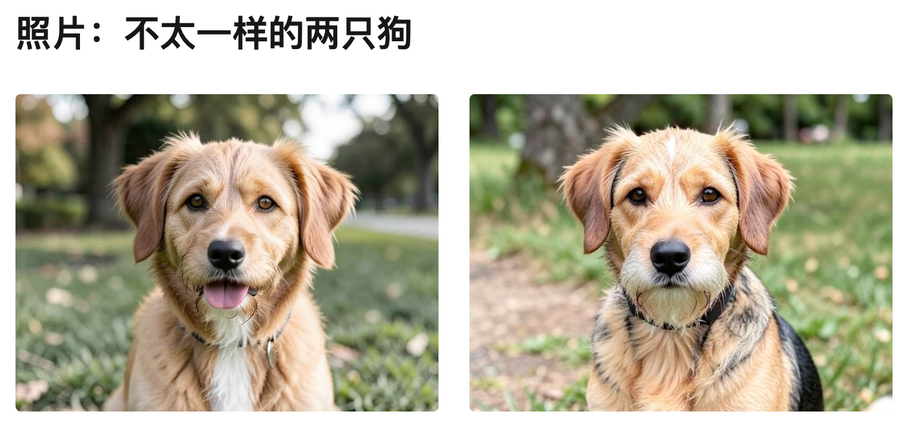
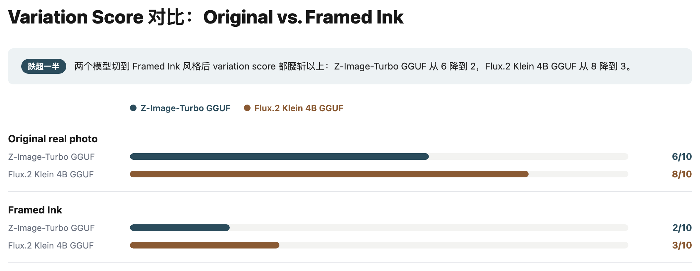
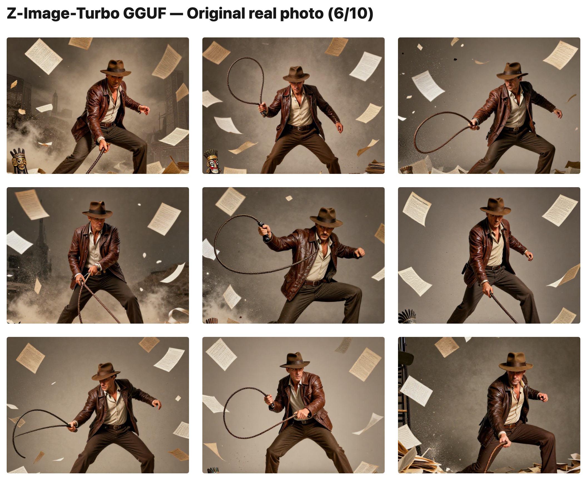
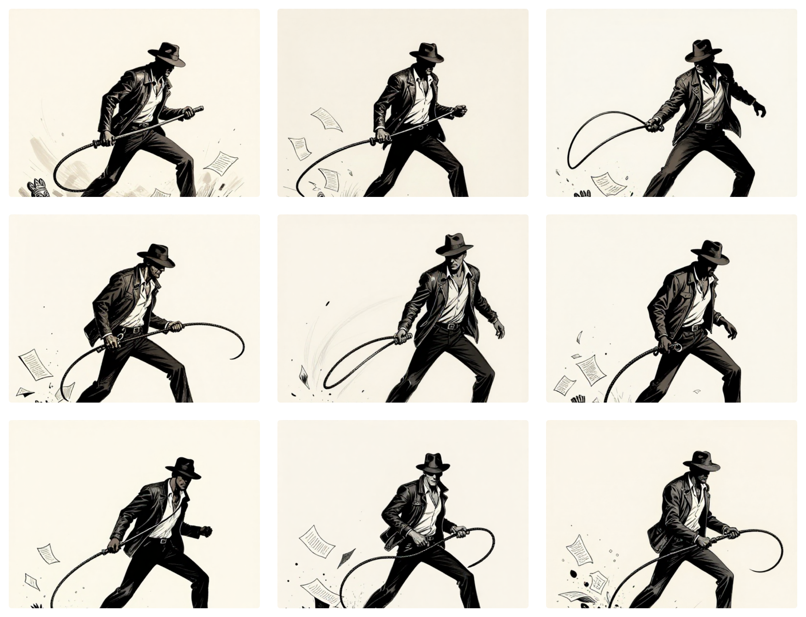
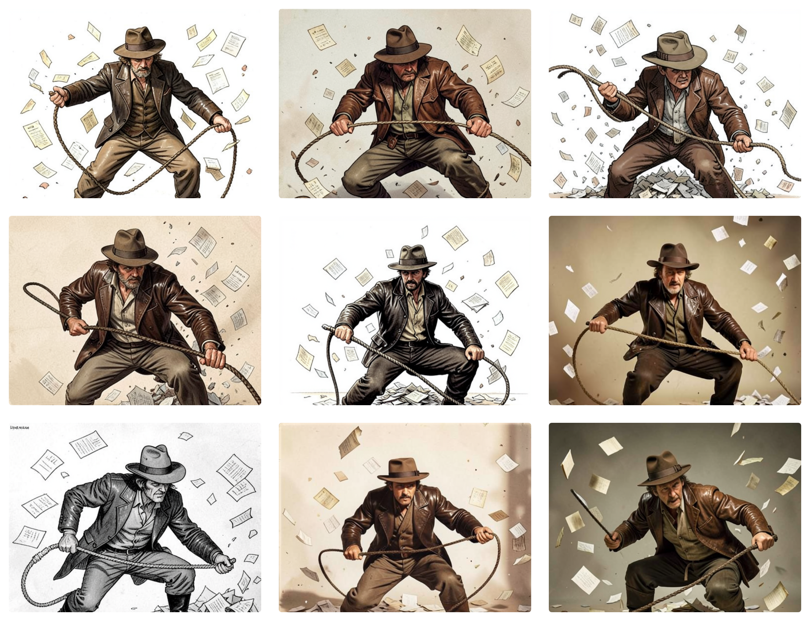
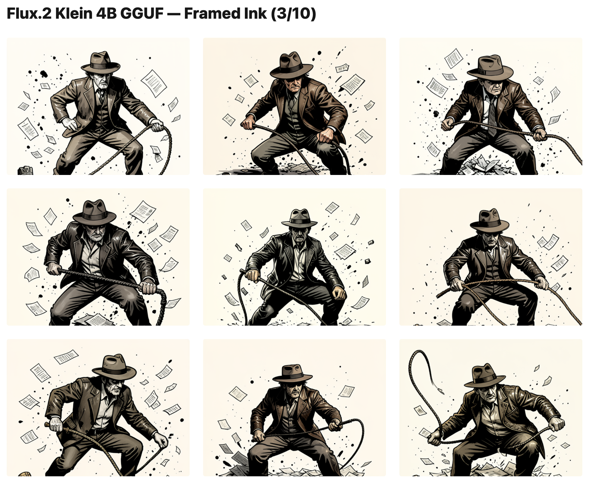

# 我该怎么选生图的风格

照片风格还是插画风格？

**要点**：插画风格直接生图变化不多。从照片风格开始，后面改风格更实际。

我想要那种黑白插画风格的图片。同时我又希望能每次都能有不同变化的图片，比如人物的姿势稍微不同。这样我可以从多张变化中选出最好的一张。

所以这次我们来测试一下不同生图风格和多样性的关系。

我让 Z-Image-Turbo 和 Flux.2 Klein 都做了尝试。它们用同样的提示词，同样的配置，不同的种子数值。再让 

种子数值是用来控制多样性的，数值不同，结果不同。比如你用 925807063139701 这个数值生成一只狗，可能得到一只。换成了345693063902986，你会得到另一只不太一样的狗。

多样性对比  

Source: [variation-comparison-trial-results.md](variation-comparison-trial-results.md)  
(9 explicit seeds condition only; batch=9 tracked these results closely  
and is omitted here for simplicity)

**Hedge:** variation/quality scores are subjective 1-10 ratings assigned
by Claude Sonnet 5 looking at the images, not by a human rater — treat
them as a rough signal (the direction and size of the gap is large and
visually obvious from the grids below), not a precise or validated metric.

### Z-Image-Turbo GGUF — Original real photo (6/10)

### Z-Image-Turbo GGUF — Framed Ink (2/10)

### Flux.2 Klein 4B GGUF — Original real photo (8/10)

### Flux.2 Klein 4B GGUF — Framed Ink (3/10)

Cross-model reproduction (Z-Image-Turbo's `dpmpp_sde`/5-step vs. Klein's
guidance-distilled `euler`/4-step) rules out a single sampler/architecture
quirk — the collapse tracks the Framed Ink prompt block across both.

## Notable side effect

Framed Ink's low variation is largely why it scored a *higher* good-count
than the Original photo condition: since the composition barely changes,
there's little scene-fidelity risk on any given seed. The Original photo
condition's lower good-count came from real fidelity misses (e.g. whip
reading as held-in-air or cane-like) that a repeated composition wouldn't
expose. Framed Ink also under-realized "papers exploding into the air"
(3-6 sheets vs. Original's 5-15+) — a separate prompt-adherence gap, not
caused by variation or seeding method.
