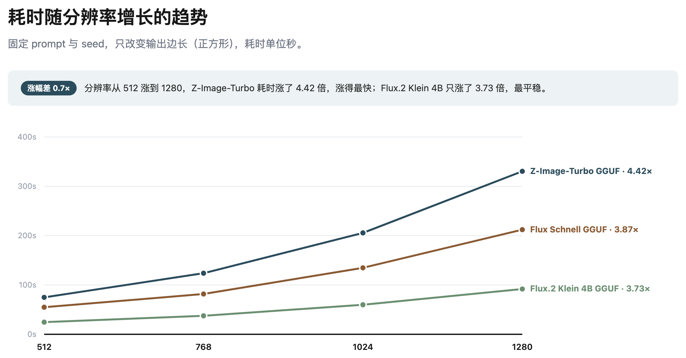
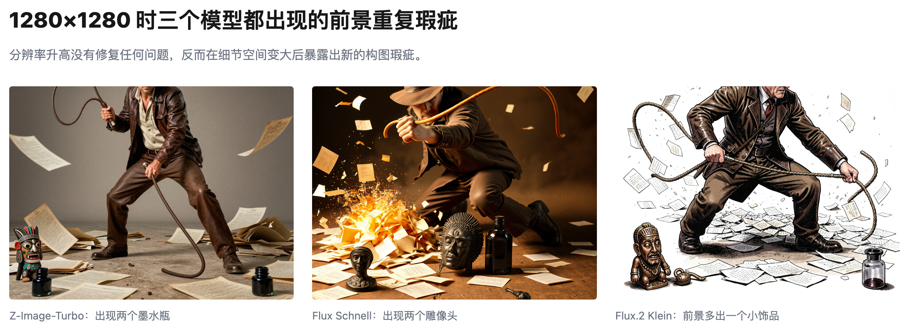
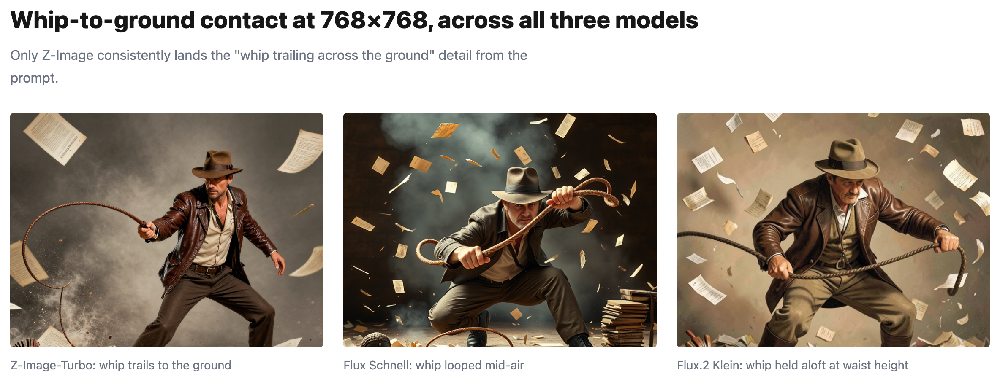

# 本地生图是不是越大越好？

横向对比三个模型看效果

**要点**：不是越大越好，768x768 正合适。从时间花费和品质上看，这个尺寸更优，而且三个不同的模型都是这样。继续提高尺寸会带来奇怪的效果。如果模型自身对动作和构图的理解力不足，再大的尺寸也没用。

---

我在自己的 Mac mini（M4，16GB）上测试了三个生图模型（Z-Image-Turbo，Flux Schnell 和 Flux 2 Klein）。我把其他参数都锁上了，只修改尺寸（512，768，1024，1280）。下面会根据时间和品质的维度具体分析。

## 一、尺寸越大耗时越长

单靠直觉我们也能想到这一点。下面的图表也验证了这个想法。

其实设计试验的时候，还是要考虑更多。比如，我不能把每次切换模型的时间算进去，而是要记录纯粹的生图时间。另外， ComfyUI 的生图流程中每个节点也是会耗时的。这种细节从简单的图表很难看出来。

| Model                | 512        | 768         | 1024        | 1280        | Time multiple (512→1280) |
| -------------------- | ---------- | ----------- | ----------- | ----------- | ------------------------ |
| Z-Image-Turbo GGUF   | 74.82s / 8 | 123.81s / 9 | 205.52s / 9 | 330.36s / 8 | 4.42×                    |
| Flux Schnell GGUF    | 54.83s / 6 | 81.78s / 7  | 134.78s / 7 | 212.05s / 6 | 3.87×                    |
| Flux.2 Klein 4B GGUF | 24.65s / 8 | 37.54s / 9  | 59.82s / 8  | 91.85s / 7  | 3.73×                    |

真正反直觉的地方在这：尺寸继续加大，品质并不会跟着变好。

## 二、768 x 768 是最佳尺寸

让我们换个思路，用回报率的角度来看。比如，我们把变大的部分用像素来表示，除以增加的秒数，就能得到「秒/百万像素」这个指标。把三个模型的平均值都算出来，再加上生图品质打分，放在图表上一起看：

从 768 之后的回报率就不高了。

往后再增加尺寸不仅不会提升品质，还会引入新问题。

## 三、提高尺寸不能修复原有问题

有时候提高尺寸可以让图片变得更好，但这也是要看情况的。生图模型训练的时候会用固定的尺寸，这个尺寸生图才保险。低于或者高于这个尺寸都会有问题。

比如模型是按照 512x512 训练的，256 生出来的图就不行，提高到 512 效果一下子就好了，可是再提高到 1024，我们可能会看到人物变成了两个头叠加在一起的诡异结果。

## 四、Flux 2 Klein 又快又好

如果我们的场景是那种简单的（机器人），Flux 2 Klein 是首选。但是如果我们的场景有复杂的人物动作和构图，就需要换 Z-Image-Turbo 了。

## 五、皮鞭的特例

在我的提示词里说到了皮鞭，只有 Z-Image-Turbo 还原了，其他模型没办法做到。不光是皮鞭的姿势奇怪，就连皮鞭本体也看上去像根绳子。这种问题和尺寸的关系不大，因为同样的 Flux 系列模型都有这种问题。

以上。
