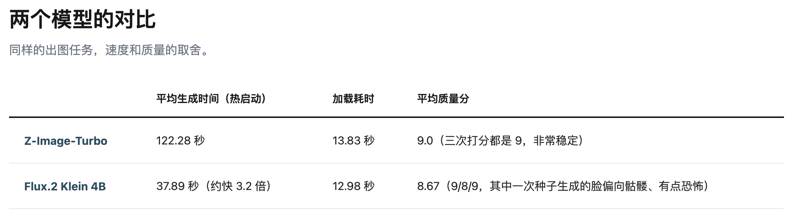
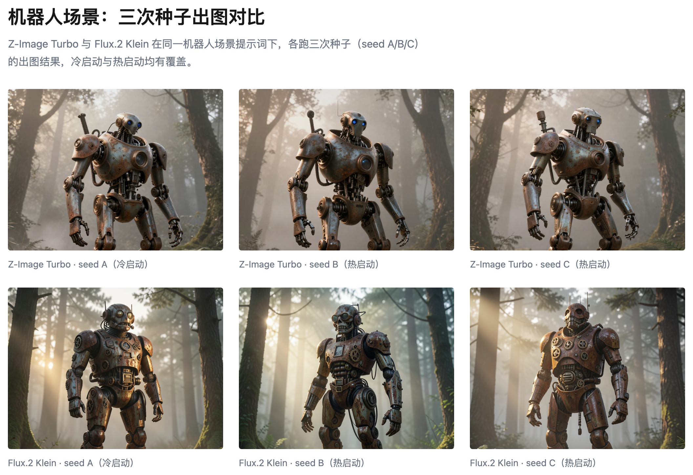

# 我选的主力模型

这是我在 Mac mini 上测试本地生图模型的第二篇。[Mac mini 生图模型测试](https://ai-companion-newsletter.beehiiv.com/p/mac-mini-image-model-benchmark)写了我测试过的多个模型， 这次我把目光集中到胜出的两个模型上，选出我的主力模型。

我的选择是：以 Z Image Turbo 为主模型, Flux.2 Klein 为副手。

Flux 要比 Z Image 快三倍 ，而且质量就差一点点。 大家直觉上会先选 Flux，但我选的是 Z Image，因为我更看重质量。

有人会说，Flux 用同样的时间可以生成三个，再选一张最好的，也可以啊。

这话是没错。 在有机器人的场景下可以。

但在我的人物动作场景下, Z Image 的理解力更好。 这种情况从 0.03 的分数差上看不出来 ，但看看出图的效果就很明显了：

从人物的样貌，到动作表达，Z Image 都更好。 当然它们对鞭子的处理都很弱，但这点和模型关系不大 ，可以忽略。

如果你和我用一样的 Mac Mini （M4，16GB）那么下面的参数你会感兴趣：

![Z-Image-Turbo 与 Flux.2 [klein] 的基础参数和运行配置对比](images/z-image-vs-flux-params-table.png)

以上。
