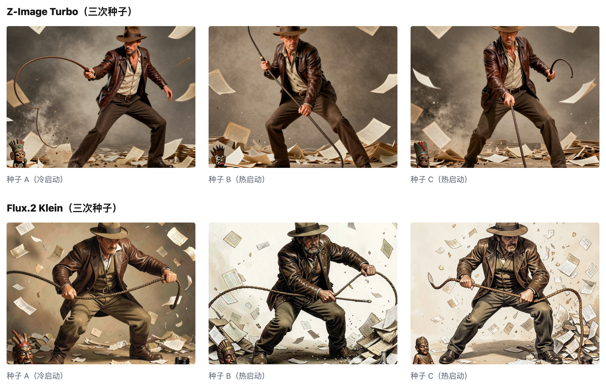

# 我选的主力模型

[Mac mini 生图模型测试](https://ai-companion-newsletter.beehiiv.com/p/mac-mini-image-model-benchmark)写了我测试过的多个模型， 这次我把目光集中到胜出的两个模型上。选出我的主力模型。

我的选择是：以 Z Image Turbo 为主模型, Flux.2 Klein 为副手。

下面是两个模型的对比:

|                     | 平均生成时间（热启动）       | 加载耗时    | 平均质量分                           |
| ------------------- | ----------------- | ------- | ------------------------------- |
| **Z-Image-Turbo**   | 122.28 秒          | 13.83 秒 | 9.0（三次打分都是 9，非常稳定）              |
| **Flux.2 Klein 4B** | 37.89 秒（约快 3.2 倍） | 12.98 秒 | 8.67（9/8/9，其中一次种子生成的脸偏向骷髅、有点恐怖） |

Flux 要比 Z Image 快三倍 ，而且质量就差一点点。 大家直觉上会先选 Flux，但我选的是 Z Image，因为我更看重质量。

有人会说，Flux 用同样的时间可以生成三个，再选一张最好的，也可以啊。

这话是没错。 在有机器人的场景下可以。

「机器人场景对比」

但在我的人物动作场景下, Z Image 的理解力更好。 这种情况从 0.03 的分数差上看不出来 ，但看看出图的效果就很明显了：

从人物的样貌，到动作表达，Z Image 都更好。 当然它们对鞭子的处理都很弱，但这点和模型关系不大 ，可以忽略。

如果你和我用一样的 Mac Mini （M4，16GB）那么下面的参数你会感兴趣：

|            | Z-Image-Turbo                           | Flux.2 [klein]                                                             |
| ---------- | --------------------------------------- | --------------------------------------------------------------------------- |
| **出品方**    | Alibaba/Tongyi-MAI                      | Black Forest Labs                                                           |
| **参数量**    | 6B                                      | 4B（9B 版本对 Mac mini 来说太大了）                                                   |
| **文本编码器**  | Qwen 系列                                 | Qwen3-4B GGUF                                                               |
| **本文用的配置** | GGUF Q4_K_S，5 步，dpmpp_sde/beta，cfg 1 | GGUF Q4_K_M UNet + flux2 VAE，4 step，euler/simple，cfg 1，guidance-distilled |

![Z-Image-Turbo 与 Flux.2 [klein] 的基础参数和运行配置对比](z-image-vs-flux-params-table.png)

以上。
